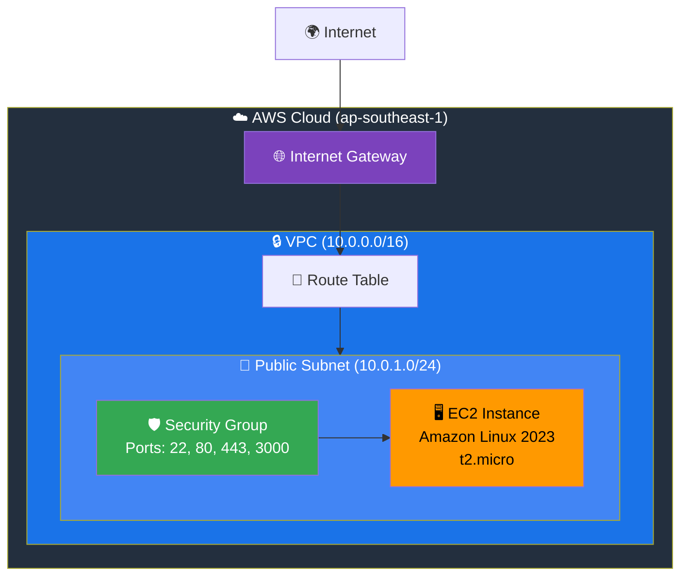
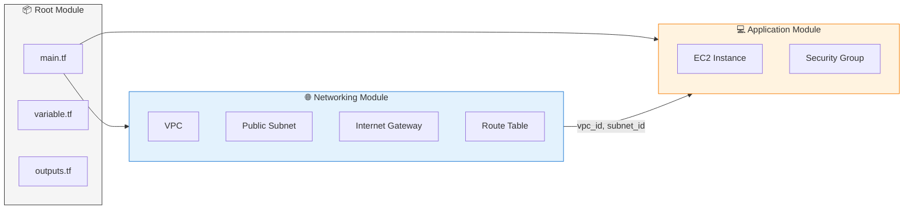

# EC2 Terraform

Deploy an EC2 instance on AWS using Terraform with a modular architecture.

## 🏗️ Architecture



## 📁 Project Structure

```
ec2-terraform/
├── main.tf                 # Root module - providers, data sources, module calls
├── variable.tf             # Input variables
├── outputs.tf              # Output values
├── terraform.tfstate       # State file (auto-generated)
└── modules/
    ├── networking/         # VPC, Subnet, Internet Gateway, Route Table
    │   ├── main.tf
    │   ├── variable.tf
    │   └── outputs.tf
    └── application/        # EC2 Instance, Security Group
        ├── main.tf
        ├── variables.tf
        └── outputs.tf
```

## 🔧 Module Overview



## 📋 Prerequisites

- [Terraform](https://www.terraform.io/downloads) >= 1.0
- [AWS CLI](https://aws.amazon.com/cli/) configured with credentials
- An AWS Key Pair in the target region

## 🚀 Quick Start

### 1. Configure AWS Credentials

```bash
aws configure
```

### 2. Initialize Terraform

```bash
terraform init
```

### 3. Review the Plan

```bash
terraform plan -var="key_pair_name=YOUR_KEY_PAIR"
```

### 4. Apply the Configuration

```bash
terraform apply -var="key_pair_name=YOUR_KEY_PAIR"
```

### 5. Connect to Your Instance

```bash
ssh -i /path/to/your-key.pem ec2-user@<EC2_PUBLIC_IP>
```

## 📥 Input Variables

| Variable            | Description                                                     | Type     | Default           |
| ------------------- | --------------------------------------------------------------- | -------- | ----------------- |
| `aws_regions`       | AWS region to deploy resources                                  | `string` | `ap-southeast-1`  |
| `availability_zone` | Availability zone for the subnet                                | `string` | `ap-southeast-1a` |
| `ami_id`            | AMI ID for EC2 (auto-fetches Amazon Linux 2023 if not provided) | `string` | `null`            |
| `key_pair_name`     | Name of the AWS key pair for SSH access                         | `string` | _Required_        |

## 📤 Outputs

| Output          | Description                           |
| --------------- | ------------------------------------- |
| `ec2_public_ip` | Public IP address of the EC2 instance |

## 🔐 Security Group Rules

| Port | Protocol | Description         |
| ---- | -------- | ------------------- |
| 22   | TCP      | SSH access          |
| 80   | TCP      | HTTP traffic        |
| 443  | TCP      | HTTPS traffic       |
| 3000 | TCP      | Node.js application |

## 🛠️ Common Commands

```bash
# Initialize Terraform
terraform init

# Format code
terraform fmt -recursive

# Validate configuration
terraform validate

# Plan changes
terraform plan -var="key_pair_name=YOUR_KEY"

# Apply changes
terraform apply -var="key_pair_name=YOUR_KEY"

# Destroy all resources
terraform destroy -var="key_pair_name=YOUR_KEY"

# Show current state
terraform show

# List all resources
terraform state list
```

## 📝 Notes

- The AMI is automatically fetched using a data source (latest Amazon Linux 2023)
- All resources are created in the `ap-southeast-1` region by default
- The EC2 instance is launched in a public subnet with a public IP
- Remember to destroy resources when not in use to avoid charges

## 📜 License

MIT License
