# Three-Tier Application on AWS

A high-availability web application infrastructure deployed on AWS using Terraform, featuring a Go application server with RDS MySQL database.

---

## 📐 Architecture

```mermaid
flowchart TB
    subgraph Internet
        Users["👤 Users"]
    end

    subgraph AWS["☁️ AWS Cloud"]
        subgraph VPC["VPC (10.0.0.0/16)"]
            IGW["🌐 Internet Gateway"]

            subgraph Public["Public Subnet (10.0.1.0/24)"]
                EC2["🖥️ EC2 App Server<br/>Ubuntu 22.04<br/>Go App :8080"]
                AppSG["🔒 App Security Group<br/>HTTP/HTTPS/SSH"]
            end

            subgraph DBSubnet["Database Subnet (10.0.3.0/24)"]
                RDS["🗄️ RDS MySQL 8.0<br/>db.t3.micro"]
                DBSG["🔒 DB Security Group<br/>MySQL :3306"]
            end
        end
    end

    subgraph CICD["🔄 CI/CD"]
        GH["GitHub Actions"]
    end

    Users -->|HTTP/HTTPS| IGW
    IGW --> EC2
    EC2 -->|MySQL :3306| RDS
    GH -->|SSH Deploy| EC2
    AppSG -.->|protects| EC2
    DBSG -.->|protects| RDS
```



---

## 📁 Project Structure

```
three-tier-app/
├── .github/workflows/
│   └── deploy.yml          # CI/CD pipeline for deployment
├── app/
│   ├── main.go             # Go web application
│   └── go.mod              # Go module definition
└── terraform/
    ├── main.tf             # Root module configuration
    ├── variables.tf        # Input variables
    ├── outputs.tf          # Output values
    ├── terraform.tfvars.example
    ├── networking/         # VPC, subnets, gateways
    ├── compute/            # EC2 instances, security groups
    └── database/           # RDS MySQL, security groups
```

---

## 🧩 Components

| Layer        | Component        | Description                         |
| ------------ | ---------------- | ----------------------------------- |
| **Network**  | VPC              | Isolated network (`10.0.0.0/16`)    |
|              | Internet Gateway | Public internet access              |
|              | Public Subnet    | App server (`10.0.1.0/24`)          |
|              | Database Subnet  | RDS instance (`10.0.3.0/24`)        |
| **Compute**  | EC2 (t2.micro)   | Ubuntu 22.04 running Go application |
|              | Security Group   | Allows HTTP, HTTPS, SSH             |
| **Database** | RDS MySQL 8.0    | Managed database (db.t3.micro)      |
|              | Security Group   | Allows MySQL only from App server   |
| **CI/CD**    | GitHub Actions   | Automated build & deployment        |

---

## 🚀 Quick Start

### Prerequisites

- AWS CLI configured with credentials
- Terraform >= 1.0
- SSH key pair in AWS

### Deploy Infrastructure

```bash
cd terraform

# Initialize Terraform
terraform init

# Copy and configure variables
cp terraform.tfvars.example terraform.tfvars
# Edit terraform.tfvars with your values

# Preview changes
terraform plan

# Deploy
terraform apply
```

### Required Variables

| Variable      | Description           | Default          |
| ------------- | --------------------- | ---------------- |
| `aws_region`  | AWS region            | `ap-southeast-1` |
| `key_name`    | SSH key pair name     | `app-key-pair`   |
| `db_password` | RDS database password | -                |

---

## 🔄 CI/CD Pipeline

Automated deployment via GitHub Actions:


### Required GitHub Secrets

| Secret                | Description             |
| --------------------- | ----------------------- |
| `EC2_HOST`            | EC2 public IP or DNS    |
| `EC2_SSH_PRIVATE_KEY` | SSH private key content |

---

## 🔐 Security

- **App Server**: Accepts HTTP (80), HTTPS (443), SSH (22)
- **Database**: Accepts MySQL (3306) only from App server
- **RDS**: Not publicly accessible
- **Backups**: 7-day retention with daily backups

---

## 📤 Outputs

After `terraform apply`, you'll receive:

| Output            | Description                  |
| ----------------- | ---------------------------- |
| `app_public_ip`   | Public IP to access the app  |
| `app_public_dns`  | Public DNS of the app server |
| `db_endpoint`     | RDS connection endpoint      |
| `connection_info` | Connection instructions      |

---

## 📝 License

MIT
